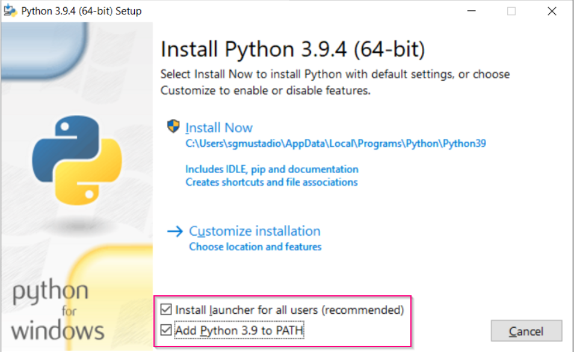
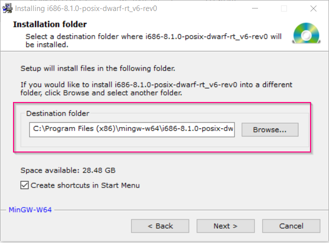
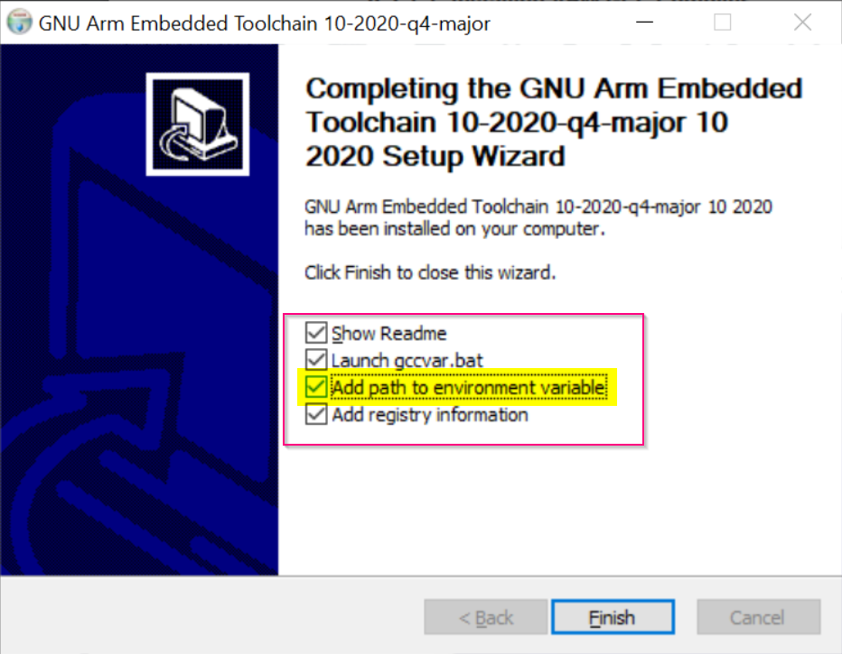
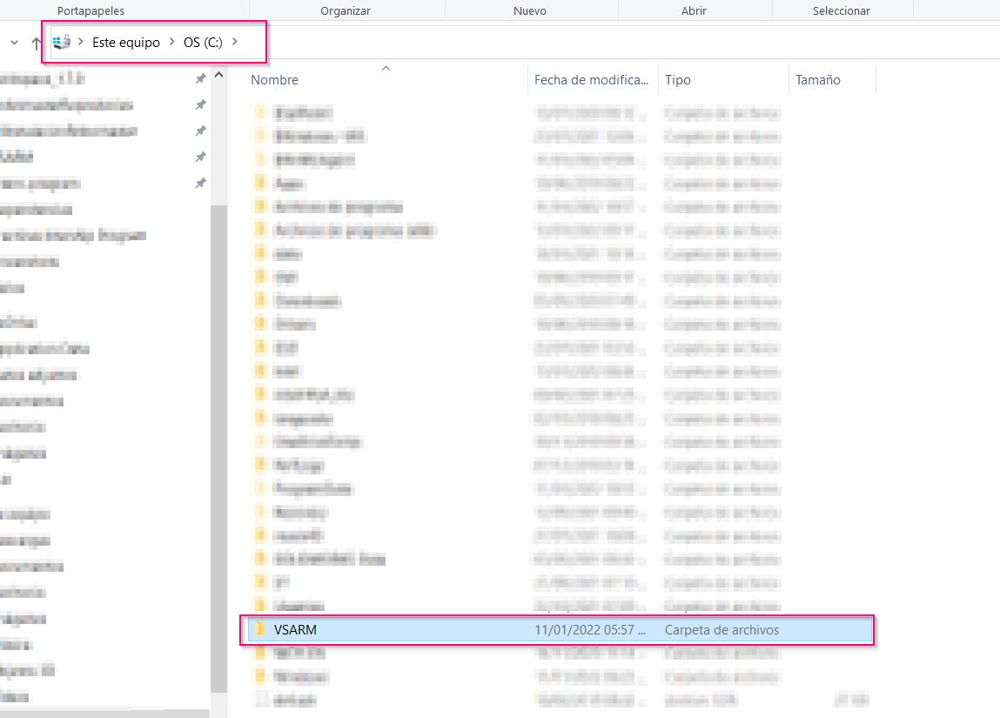
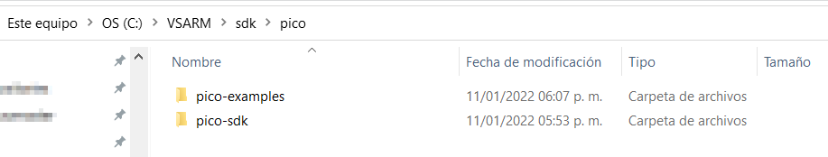
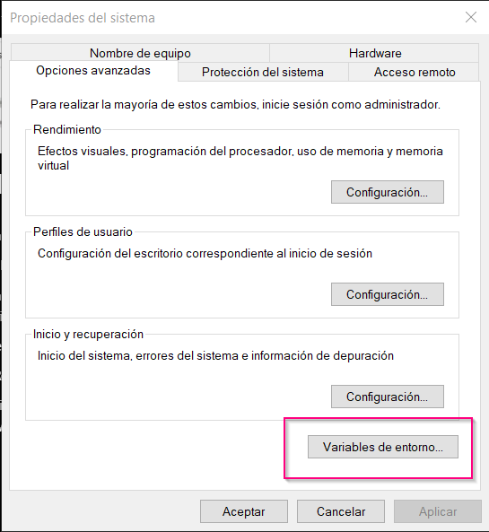
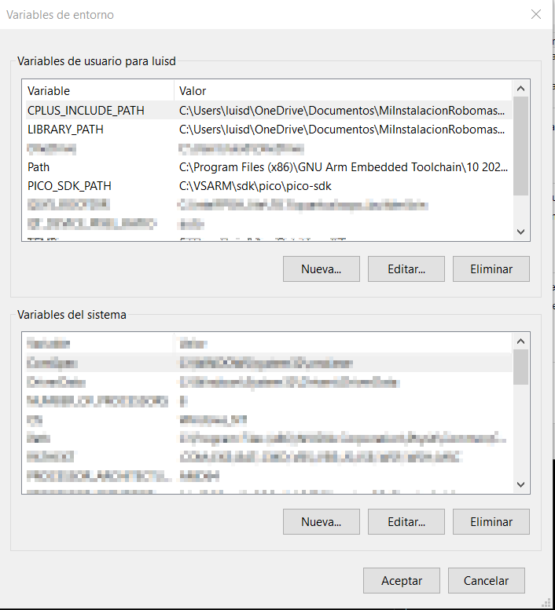
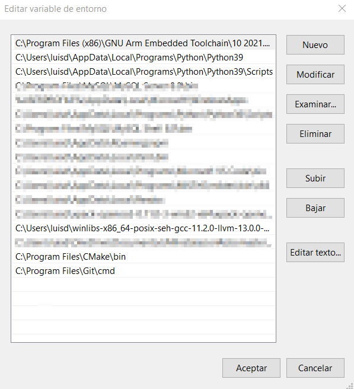
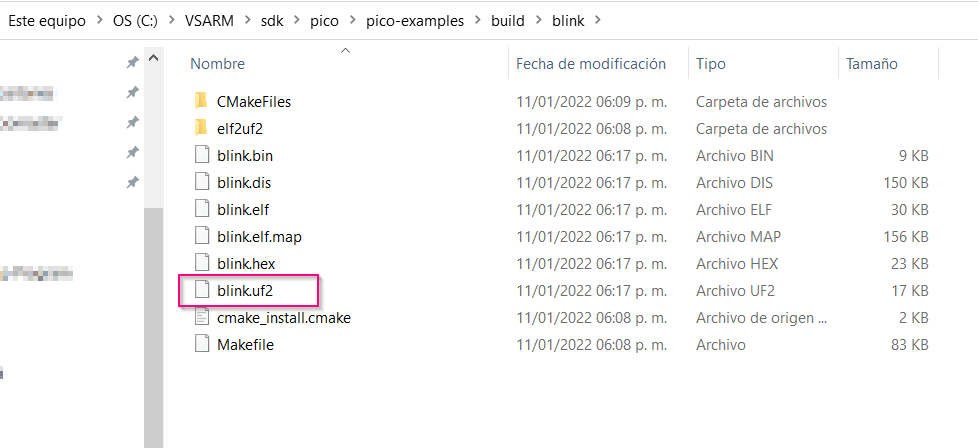

# Practica 0: Configuración Entorno de Desarollo Raspberry Pico en Windows

¡Bienvenido! Estas prácticas tienen como objetivo que te familiarices con conceptos básicos de sistemas embebidos y compiladores. Sin duda alguna, estas habilidades te servirán en tu carrera como ingenier@ de software.

# a) Documentación Util

- Para tu aprendizaje, trabajaras con la tarjeta de desarollo Raspberry Pi Pico. El pinout de la tarjeta se muestra a continuación.


### Consejo: Ten esta imagen a la mano siempre que trabajes con la tarjeta.

- Tambien, te invito a descargar el [Manual de Raspberry Pi Pico en C/C++](https://datasheets.raspberrypi.com/pico/getting-started-with-pico.pdf) de la Fundación Raspberry. En el podras encontrar documentación sobre las funciones de la API y metodos de instalación para Linux y Mac.
- Finalmente, la documentación de la API se encuentra disponible de igual manera en Doxygen: [Documentación en Linea](https://raspberrypi.github.io/pico-sdk-doxygen/)

 # b) Descarga las dependencias necesarias

 La primera practica consistirá en configurar un entorno de desarrollo que te permitirá compilar y cargar código a la tarjeta de desarrollo Raspberry Pi Pico. Esta guía cubre la metodología para configurar un entorno de desarrollo en Windows desarrollada por [Shawn Hymel](https://shawnhymel.com/). Se eligió Windows, porque es el sistema operativo donde resulta más dificil configurar el ambiente de desarrollo. En el futuro se desarrollarán versiones de Linux y Mac, aunque los usuarios de dichos sistemas operativos pueden encontrar guías disponibles en la documentación de la fundación Raspberry ([Manual de Raspberry Pi Pico en C/C++](https://datasheets.raspberrypi.com/pico/getting-started-with-pico.pdf)).

 ### Para la fuente original en la cual se inspira este tutorial, consulta la [Guia de Shawn Hymel](https://shawnhymel.com/2096/how-to-set-up-raspberry-pi-pico-c-c-toolchain-on-windows-with-vs-code/).
  

Las dependencias que requieres son:
- [Python](https://www.python.org/downloads/)
- [Git](https://git-scm.com/download/win)
- [CMake](https://cmake.org/download/)
- [Mingw64](https://sourceforge.net/projects/mingw-w64/files/Toolchains%20targetting%20Win32/Personal%20Builds/mingw-builds/installer/mingw-w64-install.exe/download)
- [GNU Arm Embedded Toolchain](https://developer.arm.com/tools-and-software/open-source-software/developer-tools/gnu-toolchain/gnu-rm/downloads)

En la carpeta [Dependencias]() encontraras algunas de estas dependencias en versiones que son funcionales.Es importante tomar en cuenta las siguientes consideraciones a la hora de instalar.


- Python: Antes de instalar. asegurate de agregar la variable al path (ver imagen). Decarga solo variantes de la versión 3.9.x Otras versiones (ej. 4.x, 2.x) no podrian presentar problemas de compatiblidad. 
  


- Git (Si ya has usado github no lo instales): Acepta toda la configuración que viene por defecto.

  #### Tip: Toma una captura de pantalla o haz un copy paste del directorio donde sera instalado.
  
- CMake: **Es posible que las versiones futuras presenten errores de compatibilidad.** Solo para estar seguros. En el folder de [Dependencias]() se agregó el zip de una versión que ya fue probada. De momento no hagas nada con el.

- MingW64: Descarga el instalador que se que ofrece al momento de abrir la página. Puedes dejar la localización por defecto. <br/> 
   




  #### Tip: Toma una captura de pantalla o haz un copy paste del directorio donde sera instalado.

- GNU Arm Embedded Toolchain: Descarga la versión más reciente. Es importante que al terminar la instalación verifiques a casilla para agregar la dependencia al path.



# c) Descargar a libreria  de Raspberry Pico

Abre una terminal, y desplazate al directorio donde quieras guardar las dependencias de la Raspberry. 

### TIP: Haz una carpeta diretamente sobre el directorio de tu disco duro (C:\VSARM)



## NOTA: Si no sabes usar la terminal de windows, ver carpeta [Recursos Extra]().

En directorio C:\VSARM corre los siguientes commandos:

```
mkdir sdk
cd sdk
mkdir pico
cd pico 
git clone -b master https://github.com/raspberrypi/pico-sdk.git 
cd pico-sdk 
git submodule update --init 
cd .. 
git clone -b master https://github.com/raspberrypi/pico-examples.git

```

Si todo salió bien, deberias de el paquete de a Raspberry Pico:



# d) Actualizar variables de entorno.

Para  *GNU Arm Embedded Toolchain* y *Python* ya se agregaron las variables de entorno del sistema.
  
Falta agregar el resto.

Para esto, tienes que buscar en la barra de busqueda de Windows variables de entorno y seleccionar la primera opción. Se abrira una ventana. Da click en "Variables de entorno..."



Se abrira una ventana asi:



¿Recuerdas que te pedi que tomaras nota de los directorios de *Git*, y *MinGW64*? Ahora los necesitaras.

Primero, descomprime el zip de Zmake en una locación que conoscas. (**Recomiendo la carpeta C:/VSARM**)

Da click en el boton *Nueva* de las Variables de usuario y mete lo siguiente.

- variable: ```PICO_SDK_PATH```
- valor : ```C:\VSARM\sdk\pico\pico-sdk```

Da click en la variable "Path". Agrega los directorios de *Git*, *MinGW64*, y donde descomprimiste *CMake*. 

## IMPORTANTE: No los agreges directamente. Más bien, agrega el directorio de la carpeta \bin de cada dependencia.

Al final el path deberia de verse algo asi:




# Creación de Comandos Bash:

Ahora, procedemos a crear comandos de Bash para la terminal y para git Bash. Esto sirve para poder llamar al script de ```mingw32-make``` (necesario para la compilación y linking) con una palabra clave como solamente "make".

En la terminal de Windows:
```
echo mingw32-make %* > C:\tu_propia_ruta\mingw\mingw32\bin\make.bat
```

En una terminal de Git Bash:
```
echo "alias make=mingw32-make.exe" >> ~/.bashrc
source ~/.bashrc
```

# Ejemplo Blink

Para probar que las dependencias funcionen, compilaremos un proyecto de GIT Bash.

Esto es relativamente sencillo. Abre una terminal de windows, ve al directorio ```C:/VSARM/sdk/pico/pico-examples/``` , y corre los siguientes commandos.

```
mkdir build
cd build
cmake -G "MinGW Makefiles" ..
cd blink
make
```

Si todo salió bien, se debió de generar el archivo ```blink.uf2```



Para programar la tarjeta, necesitar presionar el boton de reset mientras connectas el cable MicroUSB. Esto la pondra en *bootloader mode*.

Ahora solo arrastra ```blink.uf2``` a la tarjeta de desarrollo, y el led de esta comenzara a parpadear.

