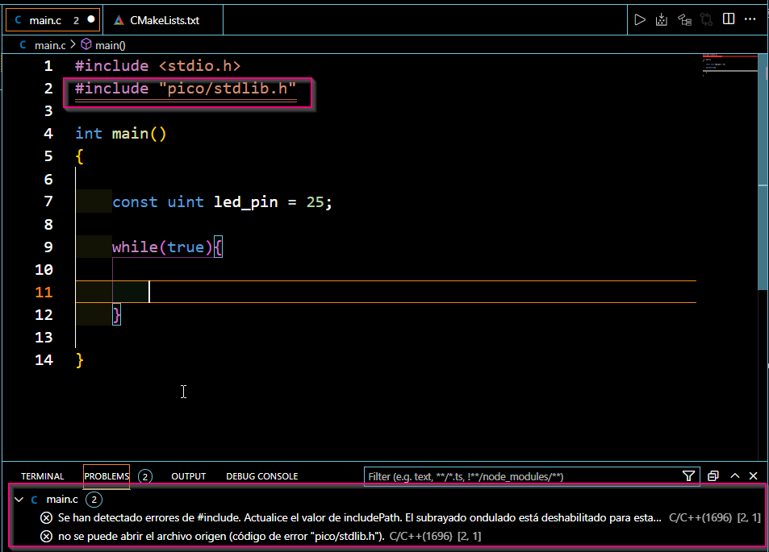

# Practica 1: Blink

Esta es la primera practica formal, y tiene el objetivo de que te familiarizes con los pines de entrada y salida de a tarjeta. 

# GPIO:

Los GPIO's (General Purpose Input Output) son, a grandes rasgos, buses de entrada y salida de la tarjeta. Es decir, son la mánera en la cual recibe o envia señales (información) al mundo exterior. Esta señales, por lo general, son analogicas (piensalo como un numero decimal) o dijitales (1 o 0).

Vamos a aprender a operar los pines de la tarjeta de Raspberry Pico.

# Documentación:


# Creación del script:

a) Crea un folder en un directorio conocido. Recomiendo que tengas todas las practicas en el mismo directorio. Nombralo con un nombre significativo (ej. *Practica 1*).El punto es que sepas donde esta. <br/>
b) Dentro de este, crea dos folders: *blink1* y *blink2*.<br/>
c) Abre *blink1* en VsCode.<br/>
d) Dentro de *blink1* crea un archivo llamado main.cpp y copia el siguiente código:
```
#include <stdio.h>
#include "pico/stdlib.h"

int main()
{

    const uint led_pin = 25;

    // Loop forever
    while (true)
    {


    }
}
```
- NOTA: Si ves el error de la imagen la terminal de VsCode, no te asustes, eso deberia desaparecer en cuanto compiles.
  


La linea ```const uint led_pin = 25;``` declara el GPIO asociado al LED verde interno del la tarjeta con un entero sin signo. El valor es 25 debido a que ese es su identificador dentro de la arquitectura de la tarjeta:


Ahora el ciclo while infinito se declara debido a que ahi meteremos el código que ejecutara la tarjeta perpeutamente. La Raspberry Pico es una computadora que se conoce como *Sistema en Chip*. Basicamente, comprime todos los aspectos escenciales de la arquitectura computacional (mémoria, GPIO, y CPU) en un chip (el cuadrado negro del centro). 
En particular, la Raspberry Pico pertenece a un subconjunto de los *Sistemas en Chip* llamados *Microcontroladores*. De estos lo más importante que debes recordar es lo siguiente:
- No tienen sistema operativo **convecional**.
- Solo pueden realizar una sola acción. 
- Se usan para **monitorear** un entorno y responder a los inputs que reciben de este.

En general, los programas de los microcontroladores siguen siempre la misma estructura:

1) Inicialización de perifericos (GPIO, ADC, TIMERS, INTERRUPT, ETC).
2) Ejecución del programa principal.

e) Ahora, procederas a programar la parte de inicialización. Busca en la documentación las funciones para: <br/>
- Inicializar los datos primitivos de la libreria Standard de C que estan directamente vinculados a los binarios.
- Inicializar un GPIO.
- Declarar un GPIO como input o output.

Una vez que las hallas encontrado, llama a la función que inicializa los datos de la libreria standard (stdio), inicializa el pin 25, y programalo como un pin de salida.

Recursos Utiles:

- [Manual de Raspberry Pi Pico en C/C++](https://datasheets.raspberrypi.com/pico/getting-started-with-pico.pdf) 
- [Documentación en Linea](https://raspberrypi.github.io/pico-sdk-doxygen/) <br/>
  
f) Ahora que has inicializado el GPIO, es momento de programar el ciclo principal. <br/>
- Investiga la función para crear un delay en Milisegundos.
- Investiga la función para cambiar el estado lógico de un pin.

Dentro del while, programa el led tal que se prenda y se apague en internvalos de 1 segundo.

# Creacion del archivo CMake:

Un archivo de CMake es un archivo donde especificas los parametros que definen la compilación del código creación de los ejecutables con los cuales puedes debugear o programar la tarjeta.  Para esto, necesitas crear un archivo con el nombre de *CMakeLists.txt*


### NOTA: Para que el programa compile, se requiere que la libreria tenga ese nombre especifico.

Puedes usar este CMakeLists para esta práctica. Lee los comentarios para entener que esta pasando.

``` 
# Se requiere como mínimo la versión 3.12 de CMake para compilar. De lo contrario, arrojara un error. 
cmake_minimum_required(VERSION 3.12)

# Incluir las librerias propias de la Raspberry Pico (Aquellas que instalaste en la Práctica 0)
include($ENV{PICO_SDK_PATH}/external/pico_sdk_import.cmake)

# Darle un nombre al proyecto
project(blink C CXX ASM)

# Establecer el Standard Minimo de C/C++ para que el proyeto Compile
set(CMAKE_C_STANDARD 11)
set(CMAKE_CXX_STANDARD 17)

# Crear un subdirectorio en el proyecto para las librerias.
pico_sdk_init()

# Decirle a CMake de donde partir para crear el Ejecutable.
add_executable(${PROJECT_NAME} 
    main.c
)

# Crear archivos map/bin/hex/uf2 para lo que se ofresca
pico_add_extra_outputs(${PROJECT_NAME})

# Vincular a la libreria de RaspberryPico para el Linking (gpio, time, etc. funciones)
target_link_libraries(${PROJECT_NAME} 
    pico_stdlib
)


```


Una ves que se tenga en archivo CMake. Se puede compilar de la misma manera en la que se compiló el ejemplo de la Práctica 0.

Abre una terminal de VsCode. Si los bash scripts fueron creados adecuadamente, puedes ejecutar estos comandos tanto en la terminal de GitBash como en la de Windows:

Asumiendo que tu directorio sea: ```C:\...\blink```

```
mkdir blink
cd blink
cmake -G "MinGW MakeFiles" ..
make 
```


# Tarea: Programa la tarjeta para que haga un blink conectando un led Externo. Usa el folder *blink2*

### Consideraciones Importantes:

El LED interno de la Raspberry Pi Pico cierra un circuito electrico dentro de la tarjeta. El esquematico del circuito electrico se presenta a continuación:


La Rasberry Pico proporciona el voltaje para prender el LED (GPIO25), pero tambien se tiene una resitencia interna para proteger el LED y una referencia a tierra.

Al momento de conectar el LED externo, este circuito tiene que crearse en la placa de desarollo. Por ejemplo:


