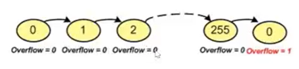
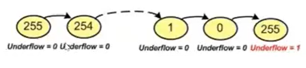
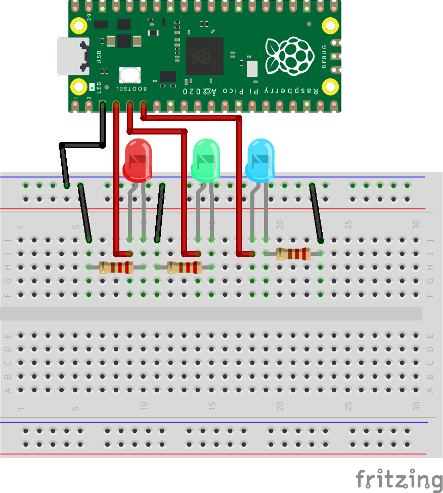

# Práctica 2: Manejo de Timers 

Bienvenido a tu segunda práctica de laboratorio. En esta préctica, te familiarizaras con el uso de **timers** para programar funciones periodicas de un microprocesador.

### ¿Que son los timers?

A grandes rasgos, los timers son conjutnos de relojes extra que tienen los microprocesadores para realizar tareas con intervalos de tiempo presisos. 

Algunas de las tareas más comunes que se pueden hacer con timers en el contexto del robot son:
- Crear delays con intervalos de tiempo especificos.
- Ejecutar acciones cada cierto tiempo.
- Generar señales de control (PWM).
  
En esta práctica, operaras un timper incorporado en la **Raspberry Pi Pico** para hacer un contador binario de 3 bits que cuente en intervalos de medio segundo.

### ¿Como funcionan los timers?
Los timers tienen módulos de registros dentro de una computadora. Estos registros guardan **banderas** y localidades de bits que le permiten al módulo contar.
La idea es que el timer puede contar hacia arriba o hacia abajo.
Entonces, el timer cuenta hacia arriba/abajo y el valor de los registos de conteo se compara con la bandera de *overflow*/*underflow*. Cuando el valor de los registros es igual al de la bandera, los registros de conteo regresan al estado original.
- Nota: Puedes pensar en los registros como espacios de memoria de una computadora donse se guarda información especifica.
Se puede anclar una función de *callback* al timer para que ejecute un bloque de código cada vez que el valor de los registros alcanza el umbral establecido por la bandera.

Las siguientes imagenes ilustrian ambos tipos de contadores (cortesia de "El Gallo" 🐓).
### Contador ascendente

### Contador descendente



# Actividad 1: Blink usando timers
## Recursos importantes:
### Pinout de la tarjeta de desarrollo:

- [Documentación Oficial](https://datasheets.raspberrypi.com/rp2040/rp2040-datasheet.pdf)
- [Documentación en Doxigen](https://raspberrypi.github.io/pico-sdk-doxygen/)


## Parte 1: Inicializa el proyecto en C

1) En el directorio de tu preferencia, crea un directorio llamado ```Practica 2```. Dentro de este, crea los nuevos directios ```blink``` y contador ```contador```. 
2) Abre VsCode en el directorio ```Practica 2```.
3) Dentro de ```blink``` el archivo ```main.c```, el archivo ```CMakeLists.txt``` y el directorio ```build```.
4) En el archivo ```main.c``` crea la estructura básica de un proyecto de c:
```c
    #include <stdio.h>
    #include "pico/stdlib.h"

    int main(){


        while(1){

        }
        return 0;
    }

```
5) Ahora, selecciona un led de tu preferencia para definirlo usando el comando *define*:
```c
    #define LED_PIN 15
```
6) Dentro de la función *main*, inicializa el led que declaraste. Esto se hace de la misma manera que en la [Práctica 1](https://github.com/Telpochcalli/intern-program/tree/main/Practica1). 


## Parte 2: Programación del Blink por un timer.

Ahora,crearemos una acción **callback** asoiada al timer interno de la *Raspberry Pi Pico* de modo que el led se encienta y se apage en intervalos de medio segundo.
Para esto, se requieren 2 cosas:
- Una función de *callback*: Se ejecutara cada vez que el timer llege a su bandera
- Un objeto de tipo struct ```struct repeating_timer```.
  
### Procedimiento:

1) Dentro de la función main crea una instancia de ```struct repeating_timer```.
2) Declara la función callback fuera de la función ```main```.
```c
bool repeating_timer_callback(struct repeating_timer *tim)
{

}
```
    Notese que la función recibe como parametro un puntero a un ```struct repeating_timer```. Adicionalmente, puedes agregar otros parametros según necesites.
3) Busca en la documentación la función que permite ligar la función ```repeating_timer_callback``` con tu instancia de ```struct repeating_timer```.
4) Busca en la documentación, la función que se llama dentro del ```while``` en operaciones de pooling.
5) Usando la función del paso 3, liga tu timer con tu función de callback con un intervalo de 500 milisegundos.
6) Llama a la función del paso 4 dentro del while infinito.
7) Dentro de cuerpo de la función ```repeating_timer_callback``` incluye el códido necesario para que el LED parpadee cada ves que esta función sea llamada.

### Consejos:
- Puedes buscar una función para el paso 7 en la[Documentación en Doxigen](https://raspberrypi.github.io/pico-sdk-doxygen/).
- Para los pasos 3 y 4 recomiendo revisar la [Documentación Oficial](https://datasheets.raspberrypi.com/rp2040/rp2040-datasheet.pdf).

# Compilacón:
Como recordaras, para programar la tarjeta, se requiere constuir los ejecutables usando el archivo *CMakeLists.txt*. Puedes usar el que fue provisto en la [Practica 1](https://github.com/Telpochcalli/intern-program/tree/main/Practica1). Solamente, **ten en cosideración que tendras que hacer algunso cambios dependiendo de como hayas llamado tu proyecto y tu archivo de C**

### Recordatorio: Comandos para compilar:
Dentro del directorio ```C:\tu_ruta\Practica2\blink```
```

    cd blink
    cmake -G "MinGW MakeFiles" ..
    make 

```
- Nota: Si no creaste el ```bat``` en la  [Practica 0](https://github.com/Telpochcalli/intern-program/tree/main/Practica0), usa el comando ```mingw32-make``` en lugar de ```make```.

### Sobre el circuito:

Una ves que hayas programado la tarjeta, recuerda que el circuito del led debe ser cerrado con una resistencia si no elegiste el GPIO asociado al LED interno de la tarjeta:


El proyecto terminado deberia de verse asi:


# Tarea: Construye el contador Binario:
Dentro del directorio ```contador``` tienes que hacer un proyecto de C para crear un contador binario como el que se muestra a continuación:


### Consejos & pistas:
  
- Necesitas **3 GPIO's** de salida que seran conectados a 3 LEDS diferentes como en el  siguiente circuito:

- La impementación del timer puede ser  **exactamente igual** a la de la actividad anterior.
- Necesitas una variable que cambie de valor cada vez que de llame a a función ```repeating_timer_callback```. Con base a esa variable, prendes la codicación binaria correspondiente.
