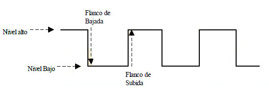

# Practica 3: Interrupts & Pull-Up/Pull-Down Resistors

En esta práctica, nos familiarizaremos con los conceptos de *interrupt service routines*, *pull-up/pull-down resistors*. 

## ¿Que es una interrupción?
En sistemas embebidos, las interrupciones son maneras de interrumpir el flujo normal de un programa ante un input que esta previsto, pero que no forma parte de la ejecución normal de un problema.  
Ej -> Programar un micro para que cierre una valvula cuando la medición de un sensor supera el umbral deseado.

## ¿Que son las configuraciónes de Pull-Up & Pull-Down?

Con circuitos que se arman en torno a un pin de entrada para determinar el estado logico por defecto de un pin.

Es decir, cuando se configura un GPIO de entrada, por defecto se encuentra en un estado lógico negativo (0), pero se puede crear un circuito electrico para que su estado lógico por defecto sea positivo (1).

De este modo, dependiendo del estado lógico por defecto, el microprocesador puede ejecutar diversas acciones cuando el GPIO cambia al estado contrario.
Esto se le conoce como responder en flanco de subida para el estado logico por defecto igual a 0 (Pull-Down) y responder en flanco de bajada cuando el estado lógico por defecto es 1 (Pull-Up):

Notese que para el caso del flanco de bajada,si el nivel de la señal es 1, la acción se ejecuta cuando la señal baja a 0. De la misma manera, cuando la señal es 0 la acción se ejecuta en cuando cambia su valor a 1 (responde en flanco de subida).

Estos efectos se pueden lograr con los circuitos que se presentan a continuación:

### Acotaciones de la imagen anterior:
- Vcc: Una fuente de voltaje.
- P1: Un interruptor que al ser presionado cambiara el estado lógico del pin de entrada.
- Vout: Aqui se conecta el pin de entrada del microprocesador.

### Nota: En esta práctica, construiras in circuito pull-up, pero en la practica, los mismos pines de la Raspberry Pi Pico (y de casi cualquier otra tarjeta) pueden ser configuraros por software como pull-up o pull-down.

# Practica 3: Interrupción
Para esta practica vas a crear una interrupcion asociada a un boton externo para que interrupa el programa y cambie el estado de un led cada vez que sea presionado.
Se partira de la tarea de la practica anterior (contador binario).

## Recursos Utiles:
- Puedes buscar una función para el paso 7 en la[Documentación en Doxigen](https://raspberrypi.github.io/pico-sdk-doxygen/).
- Para los pasos 3 y 4 recomiendo revisar la [Documentación Oficial](https://datasheets.raspberrypi.com/rp2040/rp2040-datasheet.pdf).

## Procedimiento 

1) Crea un proyecto nuevo de C. Esto implica el archivo main.c, el archivo CMakeLists.txt, y el directorio build.
2) Puedes hacer un copy paste tanto del main.c (usa el proyecto del contador binario) y del CMakeLists.txt (cambia el nombre del proyecto).
3) Ahora, sobre el archivo main.c, necesitaras seleccionar dos pines extra, uno de entrada para recibir el input de un push button configurado en pull-up, y uno de salida para la función de callback. Inicializa dichos pin de la manera correspondiente. 
4) Declara una función de callback (el nombre es indistinto) en la que incluyas el código para que el pin de salida del paso anterior niege su estado lógico actual. 
5) Ahora, dentro de la documentación, busca la función para crear una interrupción a un pin. Usala para ligar tu función de callback al pin de entrada que declaraste en el paso 3.
6) Finalmente necesitaras conectar apropiadamente un led al pin de salida que definiste en el paso 3. 
7) Ademas, tienes que constuir un circuito de pull-up resistor como el que se muestra en la figura de arriba. El Vcc corresponde al pin de alimentación de la tarjeta y el Vout corresponde al pin de entrada que configuraste y asociaste a una interrupción.
8) Compila el código y programa la tarjeta. 

El proyecto final tiene que quedar algo asi:

# Consejos:

- Si no logras alimentar el circutido de pull-up resistor con la fuente de 3.3v de la Raspberry. puedes usar un pin de salida que este siempre perdido en su lugar. Al final, el circuito deberia de quedar algo parecido a este:
  
  

- Para verificar que el circuito Pull-Up funciona correctamente, puedes conectarlo a tierra (gnd), cerrarlo con un LED, y revisar que siempre este prendido cuando el boton no esta siendo presionado.
  
  

